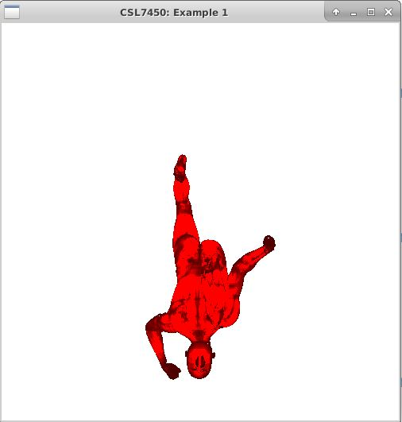
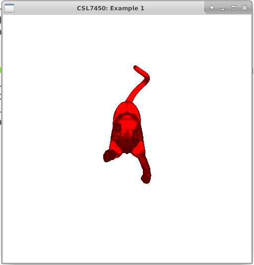
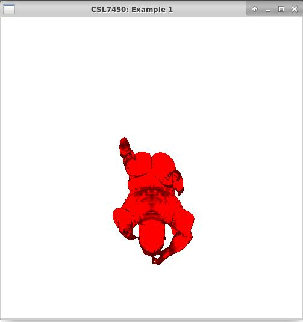
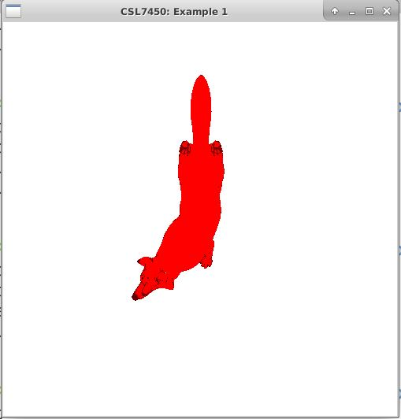

## Nirbhay Sharma (B19CSE114)
## Mayank Raj (B19CSE053)
## Assignment - 2

--------------------------------

Linux is preferred

Run.sh file is provided for easy execution of code

### **How to run**

Que1.cpp file is containing the whole code

```
bash run.sh que1.cpp
```

The que1.cpp file implements the following:

- Finding normal for every triangle
- Finding the appropriate size of view frustum to fully contain the object
- Finding the normalized device coordinates
- Implementing surface visibitlity determination algorithm
- Implemented phong shading algorithm by choosing appropriate values
- Finally rasterize the triangles to form a 2d object

**To finally get the output please enter the path of the .off file as per the prompt**


### **Results**

<div class="img">
 
</div>

<div class="img" style="margin-top:150px">
 
</div>

### **Contribution:**

- Equal contribution

--------------------------------


<style> 

table, th, td {
  border: 0.1px solid black;
  border-collapse: collapse;
}

.img {
    display:flex;
    align-items:center;
    justify-content:center;
}

</style>

<script type="text/javascript" src="http://cdn.mathjax.org/mathjax/latest/MathJax.js?config=TeX-AMS-MML_HTMLorMML"></script>
<script type="text/x-mathjax-config">
    MathJax.Hub.Config({ tex2jax: {inlineMath: [['$', '$']]}, messageStyle: "none" });
</script>