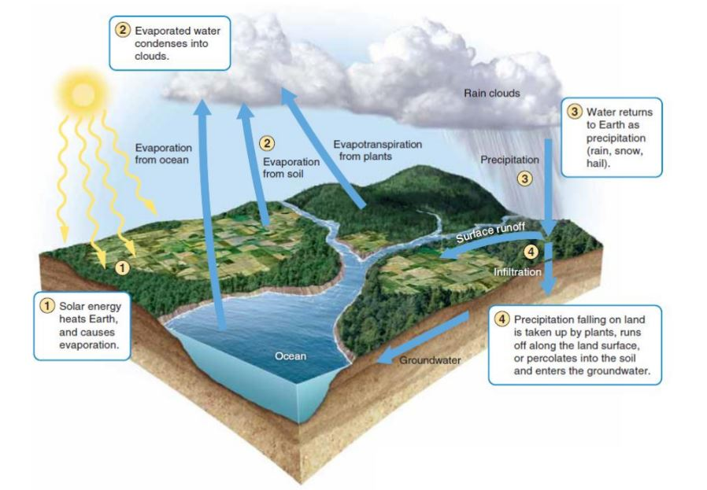
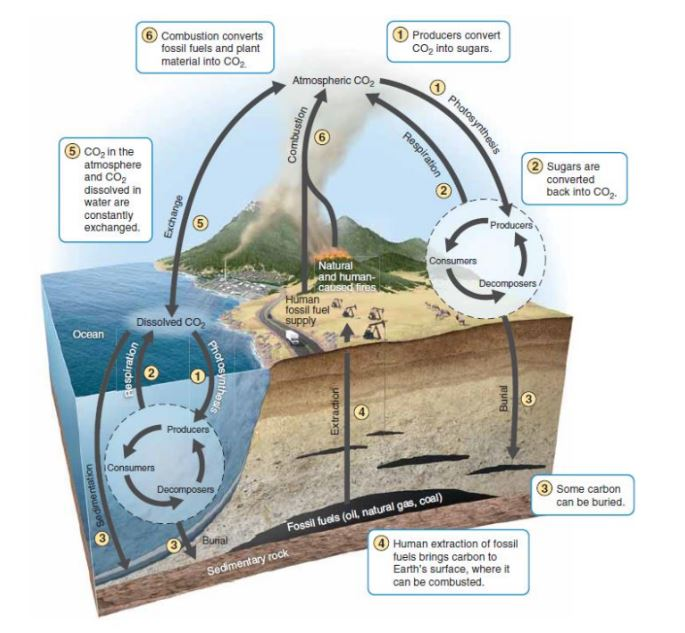
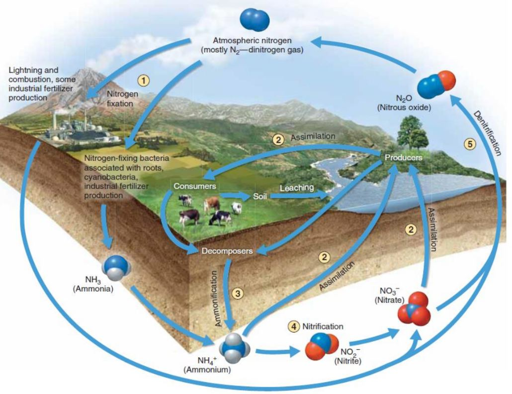

## Nirbhay sharma (B19CSE114)
## EVS - assignment

---

### Impact of human activities on ecosystem

- Ecosystem includes terrestrial and aquatic ecosystems, where terrestrial ecosystem includes, forests, grasslands, desert ecosystems etc. and aquatic ecosystem includes marine life, water, Human activities impacts all of the ecosystem in a great way, 
- firstly the main reason for disturbance in various ecosystems is exponentially increasing population and inorder to met the requirements created by over population, humans have to interfere in other ecosystems, and that interference leads to clearing lands, destroying forests, vegetations and wildlife, that leads to deforestation, extincition of various precious wildlife and many more species have to find new habitats or they lost their whole group, which leads to further degradation of that species, various valuable trees, plants etc. have to be wiped off the area in order to clear the land, leading to losing some ayurvedic medicine.
- Second reason is greed for which humans interfere in other ecosystems, greed involves setting up chemical factories in various areas, mines in various areas, which automatically leads to affect ecosystem very much, take an example of chemcical factory for instance, the waste that factory release directly goes into the fresh water or river bodies which eventually makes the water non drinkable and also kills its marine life which includes several rare species, fishes and several other marine life that live out there, mines also affects various ecosystem as they emit lot of harmful checmicals in the air leading to poisoned air, which eventually affects the birds etc and which has huge impact on us as well, triggering of earthquacks in also a byproduct of mines 
- Thirdly creating of non biodegradable substances like plastics and not recycling them in a proper way leads to huge impact on ecosystem, plastics are everywhere now a days, they are directly dumped to land where they may be eaten by any other harmless animal like cow, and they are also dumped in various water bodies like river, ponds, lakes etc, where the plastic are not going to degrade but they will stay there forever, and keep affecting various life forms.
- Fourthly the use of high frequency towers for connection, also affects the ecosystem which includes birds, eagles, pigeons etc, due to high frequency towers many birds do not able to navigate and get lost and eventually dies, which leads to huge loss in some wonderfull species

### strategies to reduce the impact

I have discussed 4 reasons due to which humand interfere ecosystems and have a huge impact on them in a negative manner, here are some suggested strategies to reduce the impact,  

- The reduction of population will help a lot in reducing the burden on earth and also it would leave enough space for other species to survive as well, which eventually leads to betterment of ecosystem 
- There is a very famout quote "There is enough for everyone's need not for anyone's greed", that's a really a true quote in today's context the greed has made us blind that we cannot see some other's habitat or some other species life is on stake due to harmful activities done by us, we should control on our greeds, for that various controlling departments should be there, that would run a check on harmful chemical factories etc. so that they don't spoil our environment
- Plastic is such a material which is non biodegradable, that is highly harmful for our lives so we should try to innovate materials that can replace plastic without affecting the usability areas 
- telephonic towers should be kept on frequency range which is bearable to birds and other species of birds that would not kill them and our would would also be done.'
- Avoid use of diesel / petrol vehicles which releases too much harmful gases in the environment, instead try using electric vehicles or solar vehicles 

### Impact of human activities on cycles

#### Impact on hydrogen cycle

- As discussed above, the human activities affects the forest ecosystem and hence are affecting the plants and forests, and as we all know plants and forests are really important part of the water cycle and hence directly affects the hydrological cycle,
- as chemicals are also continuously accumulating in the water and hence water that goes up in the form of vapour, it would have high concentration of harmful chemicals which would lead to acid rain and it eventually introduce the poisoned water in the cycle.

#### Impact on carbon cycle

- due to various activities of humans, the various gases are released in atmosphere such as $CO_2$ and $CH_4$ which eventually increases the amount of carbon in the atmosphere and that leads to increase in the content of carbon in the atmosphere and also disrupt the carbon cycle 

#### Impact on Nitrogen cycle

- Due to increased use of fertilizers the quality of nitrogen in the soil is decreasing and which leads to poor quality of nitrogen in the atmosphers
- due to releasing of various gases in the environment which contains nitrogen , gases involved $NO_2$ and $N_2O$ the nitrogen content is increasing at an abnormal rate and which eventually disrupts the nitrogen cycle 

### strategies to reduce the impact

- To reduce the impact of human activities on various cycles, we have to make sure to avoid the disturbance in the amount of gases in the atmosphere like controll the amount of carbon emission and make sure that it's quatity does not exceed the maximum amount, 
- To control the disturbance in nitrogen cycle we must avoid the use of fertilizers but use the natural resources as much as possible, that would indeed increase crop production and also would not affect the nitrogen cycle. 
- To control the disturbance in water cycle, we must avoid deforestation practices and avoid accumulation of harmful chemicals in the water as much as possible, otherwise the consequences would none other than acid rain 

### Impact of human activities on biodiversity

- The biodiversity is meased by two things, the species richness and species evenness, due to various human activities the species richness and evenness both are affecting in a huge manner
- Due to extensive killing of species for leather, trunk, medicine and whatever greedy reason it may be, it makes that species highly extinct and even some species now doesn't even exist due to that extensive hunting, that directly impacts the species richness and evenness in that area,
- We need to understand that species evenness is really important for an area, it decides that each species has equal proportion of population in that area, if the world would get dominated by only limited number of species it would affect the whole earth, and all this is due to inhuman activities done by human beings 

### strategies to reduce the impact

- If a species exists in nature, nature would have put it due to some specific reason, like honeybee, we can think it off as a very little creature but it acutally responsible for pollination and provide us honey, even mosquittos has it's own importance in nature so we should respect nature and not disturb its rules
- Extensive killing of a particular species animal/ plants must be banned as it only disturbs the nature rules and would indirectly affects the humans as well
- In **SANATAN DHARM** it is the core principle that violence (**HINSA**) is prohibited so we should follow the policy of non violance (**AHINSA**) and does not harm the harmless species, we should give nature it's time to heal, it will get better by itself.

---

