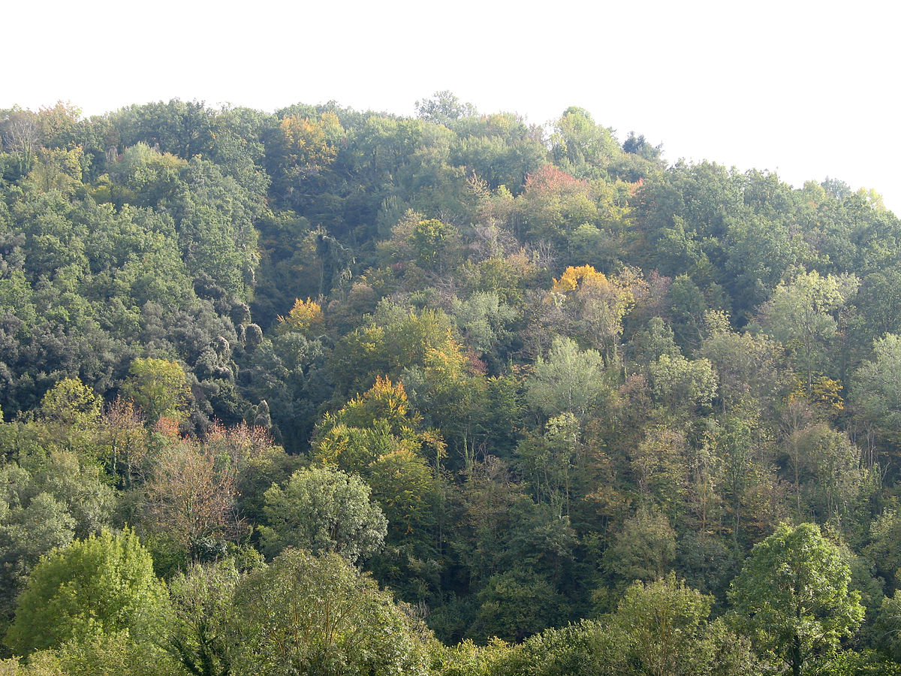
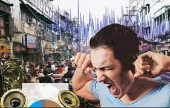

## Nirbhay sharma (B19CSE114)
## EVS - assignment

---

### **Introduction**

Article 48-A says that "the state shall endeavour to protect and improve the environment and to safeguard the forests and wildlife of the country". Similarly article 51-A states that "it shall be the duty of every citizen of India to protect and improve the natural environment including forests, lakes, rivers and wildlife and to have compassion for living creatures.". Thus it becomes a primary duty of each and every individual to improve individually in order to protect the environment.

### **Different environmental policies in INDIA**

1. Indian Forest Act
2. Wildlife protection act
3. Noise pollution act

### **INDIAN FOREST ACT**

The act primarily focuses on to consolidate and reserve the areas having forest cover, or significant wildlife. It also keeps track of the movement and transit of forest produce. It also defines the procedure to be followed for declaring an area to be a reserved forest, a protected forest or a village reserve. It defines what is a forest offence, prohibited acts inside a reserved forest and penlaties or steps taken if violation of policies is found. 

**Reserved Forest**

These are the areas of forest which are duly notified under the provisions of India Forest act. The reserve forest have full degree of protection. All kinds of activities like hunting, cutting forests, extract natural resources are illegal in a reserved forests. The example includes Attappadi reserve forest in kerela.

**Protected Forest**

A protected forests is a land notified under the provisions of indian forest act or state forest act. In protected forests, all the activities are permitted unless they are expressly prohibited. They are often subject to upgraded to wildlife scanturies and that in turn can be upgraded to national parks, with each category enjoying a higher degree of protection and funding from governemnt.

**Challanges**

- One major challange is to monitor each and every kind of wildlife and forest life in a huge area.
- Other major challange is illegal activities included in forest such as smuggling of red sandalwood and other useful natural resource in forest.

**Role of Technology**

Technology is really helpful in almost every aspect of issue. Here also we can deploy cutting edge tech to keep track and manage forests. The major technology we can deploy in here is Blockchain technology which tracks the number of forest and wildlife in an area. The major advantage it offers that no one can mutate it in any manner and it is not in any control. The track of each of forest helps the government to easily manage the forests etc.

 

### **WILDLIFE PROTECTION ACT**

The wildlife protection act is an act of parliament of India enacted for protection of plants and animal species. The act primarily provides protection of wild animal, birds and plants. During this act India prepared the list of endangered animals and plants for the first time. The act strictly prohibited hunting. It also prevents trading of animals and animals skins etc. Protected areas for wildlife includes:

**scanturies**

It is a place for refuge where injured, abandoned and abused wildlife is allowed live in peace in their natural environment without any human intervention.

**National parks**

They are the areas that are set by the government to conserve the natural environment.

**Tiger reserves**

These areas are reserved for the protection and conservation of tigers in India. They are declared on the recommendations of the National Tiger conservation authority

 

**Challanges**

- One major challange is to monitor each and every kind of wildlife and forest life in a huge area.
- Another major challange is to monitor the wildlife without disturbing their peace
- Other major challange is illegal activities included in trading of animals and illegal trading of animals skins etc majorly due to the curropted officers etc.

**Role of Technology**

Drones monitoring can be used to monitor the animals. The drones technology can be very helpful in signalling the central autority, the status of animals, hunters etc. so if any hunter tries to enter the forest to kill animals, the drones can detect them using their cutting edge state-of-the-art AI/ ML models, once detected the image of person can be sent to central authority and to the police.

### **NOISE POLLUCTION ACT**

The noise pollution act enforces the regulations on noise levels in any area / zone shall not exceed the ambient air quality standards in respect of noise. The State Government can categorize various areas into industrial, commercial, residential or silence areas for the purpose of implementation of noise standards for different areas. 

**Restrictions**

There are restrictions on using of loud speakers to address the public areas etc. The person using loud speakers or public address sytems must have a written permission from higher authority and still it should not raise the voice levels beyong a certain limit. The use of loud speakers, amplifiers in public and at night hours is strictly prohibited

**Consequences**

A person may, if the noise level exceeds the ambient noise standards by 10 dB or more given in the corresponding columns against any area / zone, can make a complaint to the authority. The authority shall act on the complaint and take strict action against the violator as per the rules.

**Challanges**

- The peoples don't obey the rules and in turn they play the songs in a very loud sounds in parties etc. thus increasing the decibal levels in an area
- The use of high bass loud speakers in various functions etc affects the noise pollution levels
- The large machines used in constructions also add a significant ammount of noise in the environment increasing the decibal levels

 

**Role of Technology**

The sensors can be used at various places prone to public addressing and parties. The sensors would detect the decibal levels and on reaching a maximum threshold they can report to the higher authorities, which in turn can take strict actions against the person. The car and other vehicles can be equipped with noise detecting sensors which can detect flaws in vehicle for disbalance in horns creating louder sounds thus indicating the person who owns the vehicle to repair it as a remainder.

---

