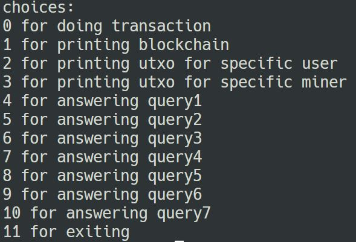

## Nirbhay Sharma (B19CSE114)
## Introduction to blockchain - Assignment - 2

----------------------------------------------------------------

### Installing and setting up dependencies

**Install the requirements using the conda .yml file**

**First create the conda env**

```
conda env create -n <env_name> -f env.yml
```

**Then activate the env**

```
conda activate <env_name>
```

**Create a database file or use the one provided**

**To create one db file use the following command**

```
touch <database_name>.sqlite3
```


### How to run

**To run the file**

**If created new database**

```
python b19cse114.py <database_name>.sqlite3
```

**If using the provided one**

```
python b19cse114.py db.sqlite3
```

### Queries

**All the queries are provided in the options**



**options 4-10 holds the answers of each query**

<style> 

table, th, td {
  border: 0.1px solid black;
  border-collapse: collapse;
}

* {
    font-family: "Monaco";
}

h3 {
    color: #e71989;
}

</style>

<script type="text/javascript" src="http://cdn.mathjax.org/mathjax/latest/MathJax.js?config=TeX-AMS-MML_HTMLorMML"></script>
<script type="text/x-mathjax-config">
    MathJax.Hub.Config({ tex2jax: {inlineMath: [['$', '$']]}, messageStyle: "none" });
</script>