## Nirbhay Sharma (B19CSE114)
## Optimization for ML - Lab 1

---


### que3

```py
import numpy as np
import matplotlib.pyplot as plt
import pandas as pd
import sys

class Config:
    xl_path = sys.argv[1]
    sample_input = np.array([4000,4+3,])

config = Config()

dt=pd.read_excel(config.xl_path)
B=dt.values
x,y = B[:,0],B[:,1]
x = x.reshape((x.shape[0],1))
y = y.reshape((y.shape[0],1))
z = B[:,2]
np_ones = np.ones((x.shape[0],1),dtype=float)
A = np.hstack((x,y,np_ones))
beta=np.dot(np.linalg.inv(np.dot(A.T,A)),np.dot(A.T,z.T))
print(beta)
print("value on sample input ")
print(beta[0] * config.sample_input[0] + beta[1] * config.sample_input[1] + beta[2])
```

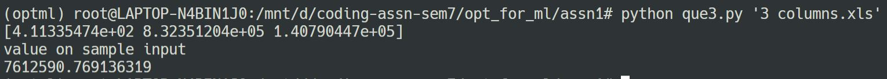

### que4

```py
import numpy as np
import matplotlib.pyplot as plt
import pandas as pd
import sys

class Config:
    xl_path = sys.argv[1]
    sample_input_x = np.array([4000])
    sample_input_y = np.array([7])

config = Config()

def polynomial_matrix(x: np.array, y: np.array):
    arr = []
    arr.append((x**2).reshape(x.shape[0],1))
    arr.append((x*y).reshape(x.shape[0],1))
    arr.append((y**2).reshape(x.shape[0],1))
    arr.append((x).reshape(x.shape[0],1))
    arr.append((y).reshape(x.shape[0],1))
    arr.append(np.ones((x.shape[0],1)))
    return np.hstack(tuple(arr))

def get_solution(dt):
    B=dt.values
    x,y,z = B[:,0],B[:,1],B[:,2]
    A = polynomial_matrix(x,y)
    beta=np.dot(np.linalg.inv(np.dot(A.T,A)),np.dot(A.T,z.T))
    print(beta)
    print("value on sample input")
    print(np.sum(beta * polynomial_matrix(config.sample_input_x, config.sample_input_y)))

dt=pd.read_excel(config.xl_path)

get_solution(dt)

```

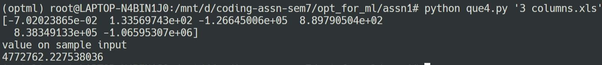

### que7

```py
import numpy as np
import matplotlib.pyplot as plt
import pandas as pd
import sys

class Config:
    xl_path = sys.argv[1]
    save_fig_path = sys.argv[2]

config = Config()

def calculate_value(x, beta0, beta1):
    return beta0 * np.exp(beta1 * x)


dt=pd.read_excel(config.xl_path)
B=dt.values
x,y=B[:,0],B[:,1]
y = np.log(y)
np_ones = np.ones((len(x),1),dtype=float)
A=np.column_stack((x,np_ones))
beta=np.dot(np.linalg.inv(np.dot(A.T,A)),np.dot(A.T,y.T))
beta[1] = np.exp(beta[1])
print(beta)
plt.figure(figsize = (10,5))
plt.scatter(x, y,c='r')
plt.plot(x, calculate_value(x,beta[1],beta[0]))
plt.xlabel('x')
plt.ylabel('y')
plt.show()
plt.savefig(config.save_fig_path)

print(calculate_value(np.array([2021]),beta[1],beta[0]))

```

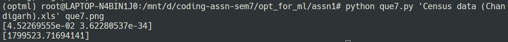

<span style="display:flex; align-items:center; justify-content:center;"> 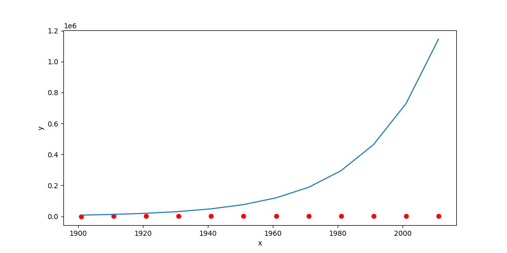</span>


### que8

```py
import numpy as np
import matplotlib.pyplot as plt
import pandas as pd
import sys
import math

class Config:
    xl_path = sys.argv[1]

config = Config()

def polynomial_matrix(x: np.array, degree):
    arr = []
    for i in range(degree,-1,-1):
        val = x ** i
        val = val.reshape((val.shape[0],1))
        arr.append(val)
    return np.hstack(tuple(arr))

def calculate_value(betas,x,degree):
    a = np.zeros(x.shape)
    for i in range(degree+1):
        a += betas[degree - i] * x ** i
    return a

def calculate_loss(betas,x,y,degree):
    a = np.zeros(x.shape)
    for i in range(degree+1):
        a += betas[degree - i] * x ** i 
    shape = x.shape[0]   
    return np.sum((a-y) ** 2) / (2*shape)

def get_solution(degree,dt):
    print(f"degree {degree} -------------- \n")
    B=dt.values
    x,y = B[:,0],B[:,1]
    A = polynomial_matrix(x,degree)
    beta=np.dot(np.linalg.inv(np.dot(A.T,A)),np.dot(A.T,y.T))

    plt.figure(figsize = (10,5))
    xl = np.linspace(min(x)-1,max(x)+1,num=100)
    plt.plot(xl,calculate_value(beta,xl,degree),c='r')
    plt.scatter(x,y)
    plt.xlabel('x')
    plt.ylabel('y')
    plt.title(f'degree: {degree}')
    plt.show()
    plt.savefig(f'que8_{degree}.png')

    return x, y, beta

dt=pd.read_excel(config.xl_path)


betas = [None]
all_avg_loss = [None]
min_avg_loss = math.inf
optimal_degree = -1
for i in range(1,21):
    x, y, beta = get_solution(i,dt)

    loss = calculate_loss(beta,x,y,i);

    if loss < min_avg_loss:
        min_avg_loss = loss;
        optimal_degree = i
    
    betas.append(beta)
    all_avg_loss.append(loss)


print(f"optimal_degree: {optimal_degree}")
print(f"avg loss at {optimal_degree} degree: {min_avg_loss:.2f}")
```

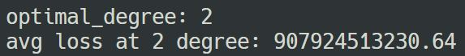

## **sample degree polynomial**

<span> 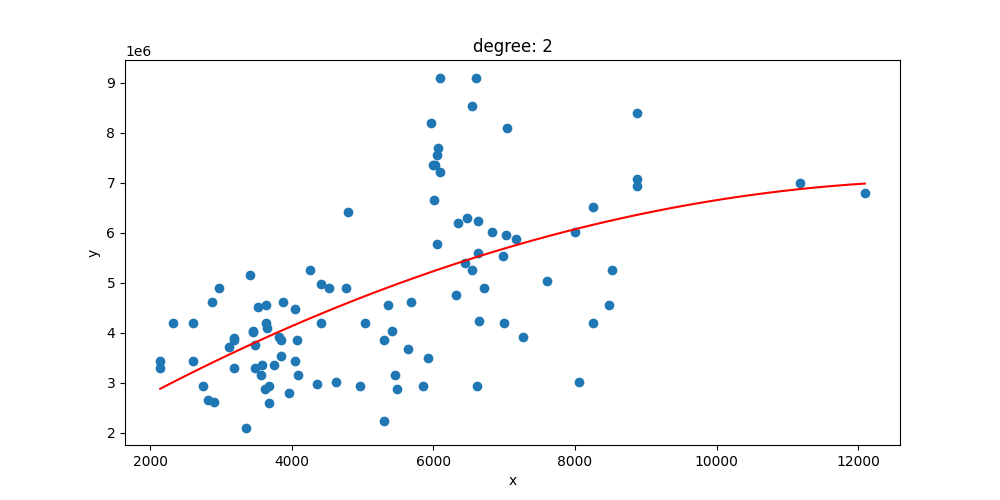 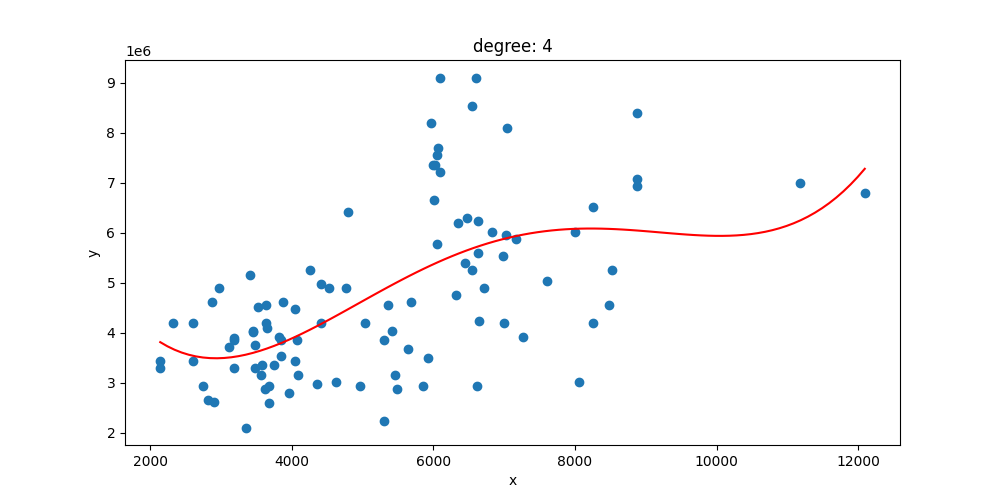 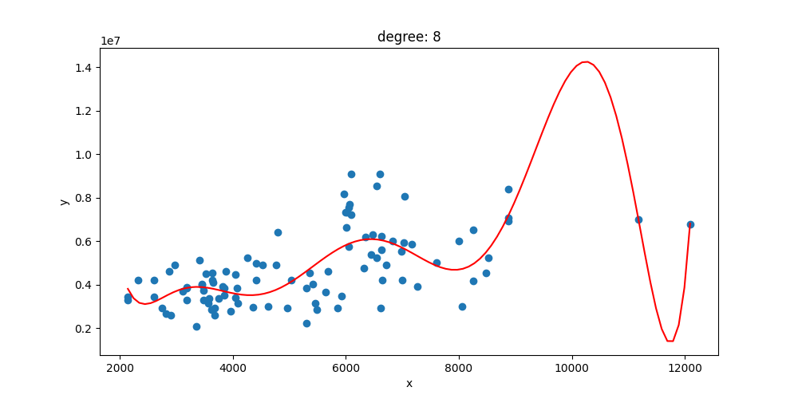 </span> 

<span>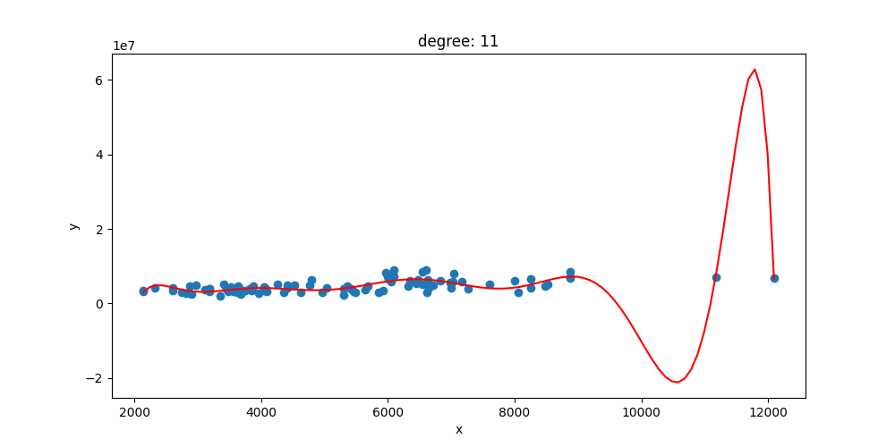 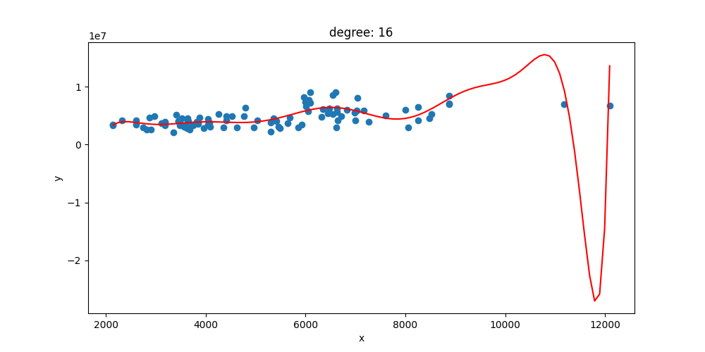 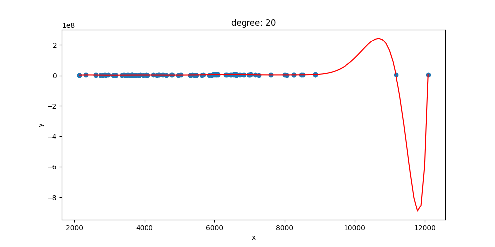 </span>

<style> 

table, th, td {
  border: 0.1px solid black;
  border-collapse: collapse;
}

*{
    font-family:"Monaco";
}
</style>

<script type="text/javascript" src="http://cdn.mathjax.org/mathjax/latest/MathJax.js?config=TeX-AMS-MML_HTMLorMML"></script>
<script type="text/x-mathjax-config">
    MathJax.Hub.Config({ tex2jax: {inlineMath: [['$', '$']]}, messageStyle: "none" });
</script>