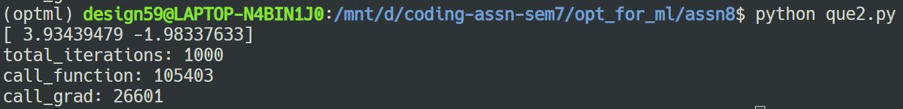

## Nirbhay Sharma (B19CSE114)
## Optimization for ML

---

### Que-1

#### Code

```py
import numpy as np
import copy

roll_no_last = 4
call_f = 0;
call_g = 0;

def calculate_f(x:np.array) -> int:
    global call_f;
    call_f += 1
    return 0.5 * (100 * (x[0] - x[1]**2)**2 + (roll_no_last - x[0]) ** 2)


def grad_f(x:np.array, n:int) -> np.array:
    global call_g;
    call_g += 1
    h = 1e-5
    grad = []
    f_value = calculate_f(x)
    for i in range(n):
        x[i] += h;
        f_x_h = calculate_f(x)
        grad_i = (f_x_h - f_value)/h
        grad.append(grad_i)
        x[i] -= h
    return np.array(grad)

def check_armijo_wolf_cond(x_k: np.array, d_k: np.array, alpha:float, beta1:float, beta2:float, n:int) -> bool:
    xk_alp_dk = x_k + alpha * d_k;
    f_grad = grad_f(x_k, n);
    f_grad_alph = grad_f(xk_alp_dk,n)
    armijo_left = calculate_f(xk_alp_dk);
    armijo_right = calculate_f(x_k) + alpha * beta1 *np.dot(f_grad.T,d_k);

    wolf_left = np.dot(f_grad_alph.T, d_k)
    wolf_right = beta2 * np.dot(f_grad.T,d_k);

    return (armijo_left <= armijo_right) and (wolf_left >= wolf_right) 


def steepest_direction(x_k:np.array, d_k:np.array, beta1: float, beta2: float, r:float, n:int) -> float:
    alpha = 1;
    while not check_armijo_wolf_cond(x_k, d_k, alpha, beta1, beta2, n):
        alpha = alpha * r
    return alpha;

def find_x(x_0:np.array, beta1:float, beta2:float, n:int, epsilon:float, r:float) -> np.array:
    x_k = x_0
    d_k = -grad_f(x_k, n)
    norm_grad = np.linalg.norm(-d_k)

    iterations = 0
    while norm_grad > epsilon:
        alpha = steepest_direction(x_k, d_k, beta1, beta2, r, n);
        x_k = x_k + alpha * d_k
        d_k = -grad_f(x_k,n)
        norm_grad = np.linalg.norm(-d_k)
        iterations += 1
        # print(f"alpha : {alpha}", end="\r")
        if iterations == 1000:
            break;
    return x_k, iterations

n = 2;
beta1 = 1e-4;
beta2 = 0.9;
epsilon = 0.001
r = 0.5
x_0 = np.array([2 * roll_no_last,-2 * roll_no_last], dtype=np.float64)

x, iterations = find_x(x_0, beta1, beta2, n, epsilon, r)

# print('\n')
print(x)

print(f"total_iterations: {iterations}")
print(f"call_function: {call_f}")
print(f"call_grad: {call_g}")


# x_new = copy.deepcopy(x)
# x_new[i] += h;
# print(x_new)
# f_x_h = calculate_fun_value(x_new)
# grad_i = (f_x_h - f_value)/h
# print(f_x_h, grad_i)
# grad.append(grad_i)
```

#### Result


### Que-2

#### Code

```py
import numpy as np
import copy

roll_no_last = 4
call_f = 0;
call_g = 0;

def calculate_f(x:np.array) -> int:
    global call_f;
    call_f += 1
    return 0.5 * (100.0 * (x[0] - x[1]**2)**2 + (roll_no_last - x[0]) ** 2)


def grad_f(x:np.array, n:int) -> np.array:
    global call_g;
    call_g += 1
    h = 1e-5
    grad = []
    f_value = calculate_f(x)
    for i in range(n):
        x[i] += h;
        f_x_h = calculate_f(x)
        grad_i = (f_x_h - f_value)/h
        grad.append(grad_i)
        x[i] -= h
    return np.array(grad)

def check_armijo_wolf_cond(x_k: np.array, d_k: np.array, alpha:float, beta1:float, beta2:float, n:int) -> bool:
    xk_alp_dk = x_k + alpha * d_k;
    f_grad = grad_f(x_k, n);
    f_grad_alph = grad_f(xk_alp_dk,n)
    armijo_left = calculate_f(xk_alp_dk);
    armijo_right = calculate_f(x_k) + alpha * beta1 *np.dot(f_grad.T,d_k);

    wolf_left = np.dot(f_grad_alph.T, d_k)
    wolf_right = beta2 * np.dot(f_grad.T,d_k);

    return (armijo_left <= armijo_right) and (wolf_left >= wolf_right) 


def steepest_direction(x_k:np.array, d_k:np.array, beta1: float, beta2: float, r:float, n:int) -> float:
    alpha = 1;
    while not check_armijo_wolf_cond(x_k, d_k, alpha, beta1, beta2, n):
        alpha = alpha * r
    return alpha;

def find_x(x_0:np.array, B:np.array, beta1:float, beta2:float, n:int, epsilon:float, r:float) -> np.array:
    x_k = x_0
    d_k = -np.dot(B,grad_f(x_k, n))
    norm_grad = np.linalg.norm(-d_k)

    iterations = 0
    while norm_grad > epsilon:
        alpha = steepest_direction(x_k, d_k, beta1, beta2, r, n);
        x_k = x_k + alpha * d_k
        d_k = -np.dot(B,grad_f(x_k,n))
        norm_grad = np.linalg.norm(-d_k)
        iterations += 1
        if iterations == 1000:
            break;
    return x_k, iterations

n = 2;
beta1 = 1e-4;
beta2 = 0.9;
epsilon = 0.001
r = 0.5
B = np.array([[2*roll_no_last,np.sqrt(roll_no_last)],[np.sqrt(roll_no_last), roll_no_last]],dtype=np.float64)
x_0 = np.array([2 * roll_no_last,-2 * roll_no_last], dtype=np.float64)

x, iterations = find_x(x_0, B, beta1, beta2, n, epsilon, r)

# print('\n')
print(x)

print(f"total_iterations: {iterations}")
print(f"call_function: {call_f}")
print(f"call_grad: {call_g}")


# x_new = copy.deepcopy(x)
# x_new[i] += h;
# print(x_new)
# f_x_h = calculate_fun_value(x_new)
# grad_i = (f_x_h - f_value)/h
# print(f_x_h, grad_i)
# grad.append(grad_i)
```

#### Result



#### Observations

- As we can clearly compare the results from que1 that changing B matrix would actually requires more calculation of gradients and calling function,
- maybe the possible reason could be armijo-wolfe condition took some time to met

### Que-3

#### Code

```py
import numpy as np
import copy

roll_no_last = 4
call_f = 0;
call_g = 0;

def calculate_f(x:np.array) -> int:
    global call_f;
    call_f += 1
    return 0.5 * (100 * (x[0] - x[1]**2)**2 + (roll_no_last - x[0]) ** 2)


def grad_f(x:np.array, n:int) -> np.array:
    global call_g;
    call_g += 1
    h = 1e-5
    grad = []
    f_value = calculate_f(x)
    for i in range(n):
        x[i] += h;
        f_x_h = calculate_f(x)
        grad_i = (f_x_h - f_value)/h
        grad.append(grad_i)
        x[i] -= h
    return np.array(grad)

def check_armijo_wolf_cond(x_k: np.array, d_k: np.array, alpha:float, beta1:float, beta2:float, n:int) -> bool:
    xk_alp_dk = x_k + alpha * d_k;
    f_grad = grad_f(x_k, n);
    f_grad_alph = grad_f(xk_alp_dk,n)
    armijo_left = calculate_f(xk_alp_dk);
    armijo_right = calculate_f(x_k) + alpha * beta1 *np.dot(f_grad.T,d_k);

    wolf_left = np.dot(f_grad_alph.T, d_k)
    wolf_right = beta2 * np.dot(f_grad.T,d_k);

    return (armijo_left <= armijo_right) and (wolf_left >= wolf_right) 


def steepest_direction(x_k:np.array, d_k:np.array, beta1: float, beta2: float, r:float, n:int) -> float:
    alpha = 1;
    while not check_armijo_wolf_cond(x_k, d_k, alpha, beta1, beta2, n):
        alpha = alpha * r
    return alpha;

def update_b(B:np.array, x_k_1:np.array, x_k:np.array, n:int) -> np.array:
    del_k = x_k - x_k_1;
    s_k = grad_f(x_k,n) - grad_f(x_k_1,n)
    global call_g;
    call_g -= 2
    skt_delk = np.dot(s_k.T, del_k)
    skt_b_sk = np.dot(np.dot(s_k.T,B),s_k)
    s_k = s_k.reshape(s_k.shape[0],1)
    del_k = del_k.reshape(del_k.shape[0],1)
    sk_skt = np.dot(s_k,s_k.T)
    b_sk_skt_b = np.dot(np.dot(B,sk_skt),B)

    return B + (sk_skt/skt_delk) - (b_sk_skt_b/skt_b_sk) 

def find_x(x_0:np.array, B:np.array, beta1:float, beta2:float, n:int, epsilon:float, r:float) -> np.array:
    x_k = x_0
    d_k = -np.dot(np.linalg.inv(B),grad_f(x_k, n))
    norm_grad = np.linalg.norm(-d_k)

    iterations = 0
    while norm_grad > epsilon:
        alpha = steepest_direction(x_k, d_k, beta1, beta2, r, n);
        x_k_1 = x_k
        x_k = x_k + alpha * d_k
        B = update_b(B, x_k_1, x_k, n)
        d_k = -np.dot(np.linalg.inv(B),grad_f(x_k,n))
        norm_grad = np.linalg.norm(-d_k)
        iterations += 1
        if iterations == 1000:
            break;
    return x_k, iterations

n = 2;
beta1 = 1e-4;
beta2 = 0.9;
epsilon = 0.001
r = 0.5
B = np.eye(n,dtype=np.float64)
x_0 = np.array([2 * roll_no_last,-2 * roll_no_last], dtype=np.float64)

x, iterations = find_x(x_0, B, beta1, beta2, n, epsilon, r)

# print('\n')
print(x)

print(f"total_iterations: {iterations}")
print(f"call_function: {call_f}")
print(f"call_grad: {call_g}")


# x_new = copy.deepcopy(x)
# x_new[i] += h;
# print(x_new)
# f_x_h = calculate_fun_value(x_new)
# grad_i = (f_x_h - f_value)/h
# print(f_x_h, grad_i)
# grad.append(grad_i)
```

#### Result


#### Observations

- This one converges way faster than other two methods, 
- The total iterations and calling of functions and gradients is also significantly very less


### According to wolfram alpha website


### Final Insights 

- As on wolfram alpha website we can see that, the function has two points possible for minima (4,2) and (4,-2)
- The outcome from all the above 3 algorithms is near to (4,2) and (4,-2) and hence it also proves the algorithms indeed converges

---


<style> 

table, th, td {
  border: 0.1px solid black;
  border-collapse: collapse;
}

* {
    font-family: "Monaco";
}

h3 {
    color: #e71989;
}

</style>

<script type="text/javascript" src="http://cdn.mathjax.org/mathjax/latest/MathJax.js?config=TeX-AMS-MML_HTMLorMML"></script>
<script type="text/x-mathjax-config">
    MathJax.Hub.Config({ tex2jax: {inlineMath: [['$', '$']]}, messageStyle: "none" });
</script>